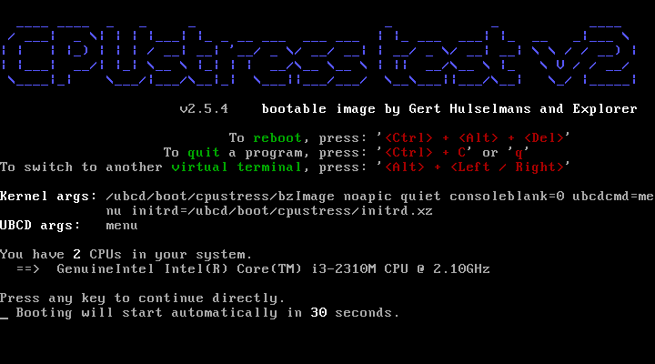

CPUstress test
==============

The CPUstress test image is an initramfs image that contains several tools for
CPU stressing.

It contains the following tools:
* CPUburn
* CPU Burn-in
* CPUinfo
* Intel Optimized LINPACK Benchmark
* Mersenne Prime Test (prime95)
* Stress
* StressCPU
* System Stability Tester
* Sensors (from lm_sensors)

CPUstress is used in Ultimate Boot CD.

How to build
------------

This repository contains a few shell scripts that allows you to build disk
images for different uses. However, there's no Makefile yet so you have to
execute several scripts in a sequence.

Tools required:

1. XZ-Utils
2. p7zip
3. mkisofs or genisoimage

Except for p7zip, your Linux distribution should have provided these
off-the-shelf.

Building CPUstress for Ultimate Boot CD:

1. (Optional) Run 'scripts/git-cache-meta.sh --apply' to update the file
   modification dates. Git do not store the file dates normally so these have
   to be stored and applied manually.
2. Run 'scripts/make_7z.sh'
3. A 7z archive should appear in the top directory of the repo. This archive
   contains files you need to update CPUstress in UBCD. Unpack it to the
   'ubcd/boot/cpustress' of your extracted UBCD directory.

Building CPUstress in a standalone ISO image:

1. (Optional) Run 'scripts/git-cache-meta.sh --apply' to update the file
   modification dates. Git do not store the file dates normally so these have
   to be stored and applied manually.
2. Run 'scripts/make_iso.sh'
3. An ISO file should appear in the top directory of the repo. You may burn
   it into a CD if you like.

Authors
-------

The CPUstress image is originally made by Gert Hulselmans ("Icecube").
Based on a CPU Burn-in bootable image by Adrian Stanciu.

The image is now modified and maintained by Kang-Che Sung ("Explorer")
< explorer09 at gmail dot com >.

License
-------

The CPUstress image contains non-free programs, please read
'cpustress/nonfree.txt' for details. Unless mentioned otherwise, the programs
are licensed under the GNU General Public License version 2.

The text of the GNU General Public License version 2 is available at
'cpustress/gpl-2.0.txt'.

The GNU General Public License is applied to the shell scripts and build
scripts of the initrd image.

For licensing information about individual programs, please refer to the
website or the about page of that specific program.

Links
-----

CPUburn
* http://web.archive.org/web/20110623074500/http://pages.sbcglobal.net/redelm/

CPU Burn-in
* http://cpuburnin.com/

Intel Optimized LINPACK Benchmark
* http://software.intel.com/en-us/articles/intel-math-kernel-library-linpack-download

Mersenne Prime test (Prime95)
* http://www.mersenne.org/download/

Stress
* http://web.archive.org/web/20130520190152/http://weather.ou.edu/~apw/projects/stress/

StressCPU2
* http://www.gromacs.org/Downloads/User_contributions/Other_software/

System Stability Tester
* http://systester.sourceforge.net/

Lm_sensors
* http://www.lm-sensors.org/

Ultimate Boot CD
* http://www.ultimatebootcd.com/

